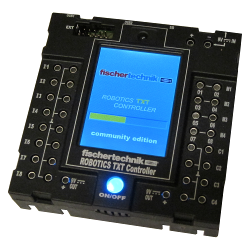

# Was ist das?

{:.right}
Die **Community-Firmware** ist ein freies und modernes Betriebssystem für deinen [**fischertechnik TXT**](https://www.fischertechnik.de/de-de/produkte/spielen/robotics/522429-robotics-txt-controller). Stark erweiterte Internet-Fähigkeiten inklusive eigenem App-Store sowie die Steuerung und Programmierung von Modellen über PC, Tablet oder Smartphone machen deinen TXT fit für die Zukunft.

**Und das Beste**: Du musst Deinen TXT dafür **nicht öffnen oder verändern**, denn die **Community-Firmware** wird auf SD-Karte installiert und kann so jederzeit wieder entfernt werden.

# So einfach geht es!

Du brauchst:
* deinen [**fischertechnik TXT**](https://www.fischertechnik.de/de-de/produkte/spielen/robotics/522429-robotics-txt-controller)
* eine MicroSD-Karte mit 2 bis 32GB Kapazität

Die Installation erfolgt in vier einfachen Schritten:

  1. Stelle sicher, dass du mindestens RoboPro Version 4.2.4 verwendest. Wir empfehlen die aktuelle Version 4.4.4.
  1. Stelle deinen TXT so ein, dass er von einer SD-Karte booten kann.
  1. Entpacke die drei im [Community-Firmware-ZIP-Archiv](https://github.com/ftCommunity/ftcommunity-TXT/releases/download/latest) enthaltenen Dateien auf deine MicroSD-Karte.
  1. Stecke die MicroSD-Karte in deinen TXT und schalte ihn ein!

Jetzt kannst du verschiedene Apps nutzen und mit [Brickly](programming/brickly), [Python](programming/python) und [ROBOPro](programming/robopro.md) deinen TXT programmieren.
Detaillierte Erklärungen zur Installation findest du in der [Installations Anleitung](getting-started/installation.html), und weitere Informationen zur CFW findest du im [fischertechnik Community Forum](https://forum.ftcommunity.de/viewforum.php?f=33).
