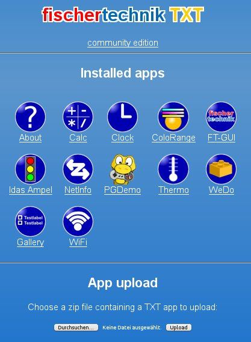

# Programmieren in Python: Die erste Anwendung

Dieses Tutorial soll den Einstieg erleichtern und die Grundschritte erklären!

Eine Anwendung besteht aus **3** Teilen:

 * Das **Programm**. Dies ist normalerweise ein Python-Script. Es könnte aber auch jede beliebige andere Programmiersprache sein. Seit [Python](https://www.python.org) der Standard für die TXT-Programmierung ist wird dieses Tutorial sich ausschließlich darauf beziehen!

 * Ein **Manifest**. Das ist eine kleine Datei die Den Programmnamen, Autor, und weitere Informationen enthält

 * Ein **Icon**. Das Icon sollte ein PNG-Bild mit 64x64 Pixeln sein. Es wird sowohl auf dem [Startbildschirm]( http://cfw.ftcommunity.de/ftcommunity-TXT/de/getting-started/usage.html) als auch in der Weboberfläche angezeigt.

## Das Programm

Das Programm kann eine beliebige, vom TXT ausführbare Datei sein. Solange das Programm vom Launcher (_Startbildschirm_) ausgeführt wird erwartet der Benutzer eine Anzeige des Programms. Deshalb sollte das Programm zumindestens eine minimalistische Oberfläche enthalten.

Aktuell benützen alle Anwendungen das [Qt4-Framework](http://www.qt.io/) für ihre Anzeigen. 
Eine minimale Anwendung sieht so aus:
```

```

Speichere diese Datei unter [`test.py`](../../../media/examples/python/tutorial-1/test.py)

**Erkärung:**
Dieses Programm definiert eine von TouchApplication (importiert aus dem Paket TouchStyle) abgeleitet Klasse, die ein Fenster mit dem Titel "Test" erstellt, solange die Anwendung nicht geschlossen wird!

## Das Manifest

Das Manifest ist eine Textdatei mit den **Eigenschaften** der Anwendung

```

```

**Notwendigen Felder:**

 * **name** ist der Name der Anwendung der im Launcher und in der Weboberfläche verwendet wird (_5-15 Zeichen lang_).
 * **icon** ist der Name des Icons. Normalerweise heißt es "icon.png"
 * **desc** ist eine kurze Beschreibung (_aktuell nur in der Weboberfläche verwendet_)
 * **exec** ist der Name des Scripts (_Im Beispiel "Test.py"_)
 * **uuid** ist eine [eindeutige identifikationsnummer](https://de.wikipedia.org/wiki/Universally_Unique_Identifier) die am TXT verwendet wird, damit es keine Konfusionen zwischen Anwendungsdaten gibt. UUIDs können auch Online generiert werden., z.B. [hier](https://www.famkruithof.net/uuid/uuidgen).
 * **managed** ist aktuell unbenutzt (_sollte aber trotzdem auf "**yes**" gesetzt werden._). Aktuell gibt es nur an ob eine Benutzeroberfläche vorhanden ist. (_Später kann damit das Framework angegeben werden_)
 * **version** ist die Versionsnummer der Anwendung.
 * **firmware** ist die Versionsnummer der Firmware für die die Anwendung getestet wurde.

**Optionale Felder:**

 * **category** wird benutzt um die Anwendungen zu Ordnern zusammenzufassen
 * **author** ist der Autor
 * **url** ist der Link zu einer Webseite, zu der du über das Webinterface gelangen kann

Speichere diese Datei als [`manifest`](../../../media/examples/python/tutorial-1/manifest)

# Das Icon

Das Icon kann jede Datei im JPEG- oder PNG-Format sein. Es muss eine Auflösung von **64x64** Pixeln haben


Ein Beispiel kann [hier](../../../en/programming/python/icon.png) gefunden werden.

# Verpacken

Jetzt hast du die drei Dateien, die für eine TXT-App unbedingt notwending sind

 * "Test.py", das Programm
 * "manifest", die Anwendungseigenschaften
 * "icon.png" Das Icon

Um diese Datein auf den TXT zu bringen muss ein ZIP-Archiv erstellt werden.(_Z.B. mit [7-Zip](http://www.7-zip.de/download.html)_) Alle 3 Datein **müssen** im Hauptordner liegen da sie der TXT sonst **nicht** findet! 

Ein Archiv der Demo ist auch [verfügbar](https://github.com/ftCommunity/ftcommunity-apps/raw/master/packages/app_tutorial_1.zip)

# Hochladen zum TXT

Rufe mit dem Browser auf deinem PC die Weboberfäche des TXT auf



Wähle mit dem Datei-Dialog das test.zip-Archiv aus und bestätige mit Upload:


Die Anwendung ist nun sichtbar!


Sie ist nun auch im Webinterface zu sehen:


Das Webinterface zeigt auch Details des Manifests


Natürlich kann die Anwendung von hieraus auch gelöscht werden.

**Fahre fort**: [Programmieren in Python: Entwicklung](tutorial-2.md)
