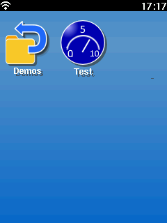
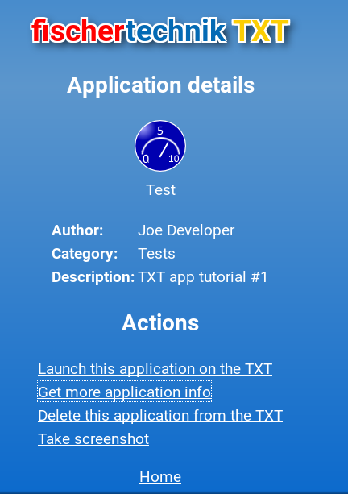

# Programmieren in Python: Die erste Anwendung

Dieses Tutorial soll den Einstieg erleichtern und die Grundschritte erklären.

Eine Anwendung besteht aus **3** Teilen:

 * Das **Programm**. Dies ist normalerweise ein Python-Skript. Es könnte aber auch jede beliebige andere Programmiersprache sein. Da [Python](https://www.python.org) der Standard für die TXT-Programmierung ist, bezieht dieses Tutorial sich ausschließlich darauf! **Wichtige Hinweise:**
    * Zum Einrücken des Codes werden Leerzeichen empfohlen. Es ist in Python3 nicht erlaubt, Leerzeichen und Tabulatoren zu mischen.
    * Das Zeilenende von Python-Code für die CFW wird durch ein einfaches Line-Feed-Zeichen (LF, ASCII-Code 10) markiert. Du musst darauf achten, dass der Editor, den du verwendest, in der Lage ist, den Code mit dem korrekten Zeilenende-Zeichen abzuspeichern.

 * Ein **Manifest**. Das ist eine kleine Datei, die den Programmnamen, Autor und weitere Informationen enthält.

 * Ein **Icon**. Das Icon sollte ein PNG-Bild mit 64x64 Pixeln sein. Es wird sowohl auf dem [Startbildschirm]( http://cfw.ftcommunity.de/ftcommunity-TXT/de/getting-started/usage.html) als auch in der Weboberfläche angezeigt.

## Das Programm

Das Programm kann eine beliebige, vom TXT ausführbare Datei sein. Da das Programm vom Launcher (_Startbildschirm_) ausgeführt wird, erwartet der Benutzer, dass das Programm etwas auf dem TXT ausgibt. Deshalb sollte das Programm zumindestens eine minimalistische Oberfläche enthalten.

Aktuell benützen alle Anwendungen das [Qt4-Framework](http://www.qt.io/) für ihre Anzeigen. 
Eine minimale Anwendung sieht so aus:
```

```

Speichere diese Datei unter ```test.py```. Du findest sie auch hier: [`test.py`](../../../media/examples/python/tutorial-1/test.py).

**Erkärung:**
Dieses Programm definiert eine von TouchApplication (importiert aus dem Paket TouchStyle) abgeleitete Klasse, die ein Fenster mit dem Titel "Test" bereitstellt, solange die Anwendung läuft.

## Das Manifest

Das Manifest ist eine Textdatei mit den **Eigenschaften** der Anwendung:

```

```

**Notwendige Felder:**

 * **name** ist der Name der Anwendung, der im Launcher und in der Weboberfläche verwendet wird (_5-15 Zeichen lang_).
 * **icon** ist der Name des Icons. Normalerweise heißt es "icon.png".
 * **desc** ist eine kurze Beschreibung (_aktuell nur in der Weboberfläche verwendet_).
 * **exec** ist der Name des Skripts (_Im Beispiel "Test.py"_).
 * **uuid** ist eine [eindeutige identifikationsnummer](https://de.wikipedia.org/wiki/Universally_Unique_Identifier), die am TXT verwendet wird, damit es keine Konfusionen zwischen Anwendungsdaten gibt. UUIDs können auch Online generiert werden., z.B. [hier](https://www.famkruithof.net/uuid/uuidgen). Die UUID wird auch verwendet, um das Verzeichnis für die App auf dem TXT zu erzeugen. Du musst für jeden App eine eigenne ID verwenden.
 * **managed** ist aktuell unbenutzt (_sollte aber trotzdem auf "**yes**" gesetzt werden._). Aktuell gibt es nur an, ob eine Benutzeroberfläche vorhanden ist. (_Später kann damit das Framework angegeben werden_).
 * **version** ist die Versionsnummer der Anwendung.
 * **firmware** ist die Versionsnummer der Firmware, für die die Anwendung getestet wurde.

**Optionale Felder:**

 * **category** wird benutzt, um die Anwendungen zu Ordnern zusammenzufassen.
 * **author** ist der Autor.
 * **url** ist für den Link zu einer Homepage der App vorgesehen.
 * **html** ist die Startdatei für das Webinterface der App, z.B index.html.


Speichere diese Datei als ```manifest```. Du findest ein Beispiel hier: [`manifest`](../../../media/examples/python/tutorial-1/manifest).

# Das Icon

Das Icon kann jede Datei im JPEG- oder PNG-Format sein. Es muss eine Auflösung von **64x64** Pixeln haben


Ein Beispiel kannst du [hier](../../../en/programming/python/icon.png) finden.

# Verpacken

Jetzt hast du die drei Dateien, die für eine TXT-App unbedingt notwendig sind:

 * "Test.py", das Programm
 * "manifest", die Anwendungseigenschaften
 * "icon.png", das Icon

Um diese Datein auf den TXT zu bringen, musst du ein ZIP-Archiv erstellen (_z.B. mit [7-Zip](http://www.7-zip.de/download.html)_). Alle 3 Datein **müssen** im Hauptordner des Zip-Archives liegen, da sie der TXT sonst **nicht** findet. 

Das fertige ZIP-Archiv gibt es [hier](https://github.com/ftCommunity/ftcommunity-TXT/raw/44dd2e2903880e5927a188c49f623cbcc83e3a3e/docs/_includes/examples/python/tutorial-1/test.zip)


# Hochladen zum TXT

Rufe mit dem Browser auf deinem PC die Weboberfläche des TXT auf:


Wähle mit dem Datei-Dialog das test.zip-Archiv aus und bestätige mit Upload.


Nach der Installation ist die Anwendung sichtbar!

    
        
So sieht die Ausgabe der Anwendung auf dem TXT aus:

       

Die Anwendung ist jetzt auch im Webinterface zu sehen:


Das Webinterface zeigt auch Details des Manifests:



Hier kannst du die Anwendung auch löschen.


**Hier geht es weiter**: [Programmieren in Python: Entwicklung](tutorial-2.md)
