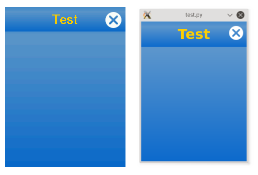
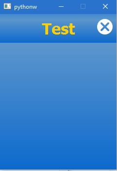

# Programmieren in Python: Entwicklung

[Programmieren in Python: Die erste Anwendung](tutorial-1.md) erklärte die Entwicklung einer einfachen App. Der komplette Entwicklungszyklus lädt eine App über das Web-Interface auf den TXT. Leider ist dieser Weg etwas umständlich, weshalb in diesem Tutorial einige Abkürzungen zur Erleichterung der Entwicklung erklärt werden.

# Update einer App über SSH

Während der Entwicklung werden normalerweise nur einzelne Dateien geändert. Daher ist es nicht nötig, in dieser Phase die ganze App immer wieder zu löschen und neu zu installieren. Es ist einfacher, geänderte Dateien über SSH auf den TXT hochzuladen.

Mit SCP (Secure Copy Protocol) kannst du die Datei `test.py` aus dem ersten Tutorial auf dem TXT aktualisieren. In diesem Beispiel ist die IP-Adresse des TXT 192.168.0.12. Die aktuelle IP-Adresse deines TXT findest du mit der Netinfo-App auf dem TXT heraus.

```
scp test.py ftc@192.168.0.12:/opt/ftc/apps/user/191fe5a6-313b-4083-af65-d1ad7fd6d281/
```

Den Verbindungsaufbau musst du auf dem TXT erlauben. Mit diesem Befehl kopierst du die neue Version der `test.py`-Datei in das richtige Verzeichnis auf dem TXT. Der Name des Verzeichnisses kommt von der UUID aus der Manifest-Datei, die du in der ZIP-Datei am Anfang hochgeladen hast. Das heißt, wenn das Manifest deiner App die Zeile ```uuid: 191fe5a6-313b-4083-af65-d1ad7fd6d281```enthielt, dann ist das Ziel-Verzeicnis `/opt/ftc/apps/user/191fe5a6-313b-4083-af65-d1ad7fd6d281`.

Jetzt kannst du die aktualisierte App auf dem TXT mit dem Launcher starten.

# Apps über SSH starten

Wenn Apps über den Launcher (Startbildschirm) gestartet werden, werden keine Fehlermeldungen angezeigt. Dies kann während der Entwicklung ein Nachteil sein. Du kannst die Apps auch starten, wenn du über SSH (als User "ftc", kein Passwort) auf dem TXT eingeloggt bist. Verbinde dich zuerst über SSH mit dem TXT (z.B. `ssh ftc@192.168.0.12`). Du musst auf dem TXT die Verbindung erlauben. In der Remote Shell gibst du ein:

```
$ export PYTHONPATH=/opt/ftc
$ /opt/ftc/apps/user/191fe5a6-313b-4083-af65-d1ad7fd6d281/test.py
```

Hinweis an TX-Pi-Entwickler: Wenn das Programm mit der Fehlermeldung "cannot connect to X server" abbricht, muß folgender Befehl vor dem Ausführen des Programmes ausgeführt werden:
```
export DISPLAY=:0.0
```

Der Pfad ergibt sich wieder aus der UUID, wie sie in der Manifest-Datei deiner App steht.

Jetzt kannst du Fehlermeldungen und Debug-Ausgaben in deiner Remote-Shell sehen.

# Apps über Telnet oder Netcat starten und stoppen

SSH ist nicht die einzige Methode, um Apps auf dem TXT von außen über WLAN zu starten. Der TXT-Launcher liefert einen kleinen Steuer-Server (Command-Server), mit dem du Apps sowohl über das Web-Interface als auch über Programme wie Telnet oder Netcat starten und stoppen kannst.

Verbinde dich über Telnet mit dem TXT auf Port 9000 mit dem Befehl: `telnet 192.168.0.12 9000` (verwende die aktuelle IP-Adresse deines TXT, die durch mit der Netinfo-App herausfindest). Wenn die Verbindung besteht, kannst du `launch user/191fe5a6-313b-4083-af65-d1ad7fd6d281/test.py` eingeben, um die Test-App zu starten. Der Befehl `stop-app` beendet die laufende App. Der Befehl `quit` schließt die Telnet-Verbindung mit dem TXT.

Du kannst die Apps auch mit Netcat starten und stoppen. Der Befehl `echo "stop-app" | nc 192.168.0.12 9000` beendet die laufende App.


# TXT-Apps auf dem PC ausführen

Trotz dieser Tricks ist die Entwicklung auf dem TXT noch nicht besonders bequem. Glücklicherweise können TXT-Apps auch auf dem PC ausgeführt werden. Aktuell basieren alle TXT-Apps auf der Programmiersprache [Python](https://www.python.org/) und dem [Qt Framework](http://www.qt.io/). Die Kombination aus beidem heißt [PyQt](https://riverbankcomputing.com/software/pyqt/intro). In der TXT-Community-Firmware ist PyQt bereits vorinstalliert. Auf einem PC muss man PyQt erst installieren, um TXT-Apps ausführen zu können.

Ein anderer Ansatz, um Python und Qt zu integrieren, ist `PySide`. PySide wird auf dem TXT nicht verwendet. Da PyQt und PySide recht ähnlich sind, kann es möglich sein, TXT-Apps mit minimalen Anpassungen unter PySide auszuführen. Dieser Ansatz wurde von uns jedoch nicht getestet.


## Unter Linux

PyQt ist für alle großen Linux-Distributionen verfügbar. Suche mit deinem bevorzugten Paket-Manager nach einem Paket namens `pyqt`, `python-qt` oder ähnlich und installiere es.

Die TXT-Apps brauchen ein spezielles Qt-TXT-Thema. Um die TXT-Apps auf dem PC ausführen zu können, müssen die Dateien für dieses Thema auch auf dem PC installiert werden.

Kopiere `TouchStyle.py` und das ganze `themes`-Verzeichnis in ein gemeinsames Verzeichnis auf deinem PC. Du findest diese Dateien im [Repository](https://github.com/ftCommunity/ftcommunity-TXT/tree/master/board/fischertechnik/TXT/rootfs/opt/ftc).

Wenn du die Dateien in dem Verzeichnis abgelegt hast, in dem auch deine App abgelegt hast, brauchst du nichts weiter zu tun. Wenn sie an einem anderen Ort liegen, musst du Python mit diesem Ort bekannt machen. Wenn `TxtStyle.py` und das `themes`-Verzeichnis unter `/tmp/mytxtenv` liegen, dann musst du folgendes eingeben:

```
export PYTHONPATH=/tmp/mytxtenv
```
um Python über den Pfad zu den anderen Dateien zu informieren.

Außerdem musst du sicherstellen, dass dein Python-Programm ausführbar ist:

```
$ chmod +x test.py
```

Mit diesem Befehl startest du deine App auf deinem PC:

```
$ ./test.py
```

Die Datei `TouchStyle.py` stellt fest, dass die App auf einem PC läuft und baut ein Fenster mit 240x320 Pixel.

Du wirst merken, dass die Apps auf dem TXT und dem PC nicht 100 % gleich aussehen. Ein Grund ist die unterschiedliche Darstellung der Schrift auf dem TXT und dem PC. Außerdem sind die Qt- und Python-Versionen nicht auf beiden Systemen gleich. Schließlich läuft die App auf dem PC unter einem X11-Window-System, während der TXT den QWS-Window-Manager für Embedded Systeme verwendet. Die Änderungen sind aber so klein, dass eine bequeme App-Entwicklung auf dem PC möglich ist.

    

Kleine Abweichungen in der Schriftdarstellung zwischen TXT (links) und PC (rechts)

## Unter Windows

PyQt4 ist für so gut wie alle Windows-Versionen verfügbar. Um es zu installieren, gehe auf die Download-Webseite von [PyQt4](https://sourceforge.net/projects/pyqt/files/PyQt4/PyQt-4.11.4/) und lade dir dort die passende Datei herunter. (*Für ein Windows x64 mit Python 3.4 x64 wäre [**PyQt4**-4.11.4-gpl- **Py3.4** - **Qt4.8.7** - **x64** .exe](https://sourceforge.net/projects/pyqt/files/PyQt4/PyQt-4.11.4/PyQt4-4.11.4-gpl-Py3.4-Qt4.8.7-x64.exe/download) die richtige Datei.*)

TXT Anwendungen benötigen jedoch ein spezielles Thema, damit sie wie auf dem TXT aussehen. Lade dir dies von [Github](https://github.com/ftCommunity/ftcommunity-TXT/tree/master/board/fischertechnik/TXT/rootfs/opt/ftc) herunter (*Du brauchst die Datei `TouchStyle.py` und den Ordner `themes`.*) Kopiere diese Dateien in deinen `site-packages`-Ordner. Schreibe nun ein Testprogramm. Jetzt kannst du in die Windows-Konsole gehen und wenn du `python Test.py` eingibst, wirst du auch sogleich ein TXT-Fenster sehen.

 
