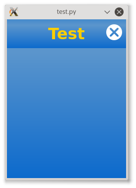
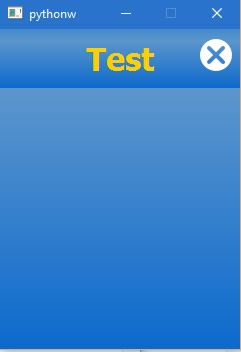

# Programmieren in Python: Entwicklung


[Programmieren in Python: Die erste Anwendung](tutorial-1.md) erstellte eine erste Anwendung. Im letzen Tutorial wurde die Anwendung über die Weboberfläche hochgeladen. Das ist für die Entwicklung nicht sehr schnell und effizient. Dehalb werden dir in diesem Tutorial andere Wege gezeigt!

# App Update über SSH

Während der Entwicklung werden meisten nur einzelne Dateien verändert, deshalb wäre es unsinnvoll jedesmall alle Dateien hozuladen. Stattdessen lönnen einzellene Dateien über [SSH](https://de.wikipedia.org/wiki/Secure_Shell) hochgeladen werden.

Mit einem Kommandozeilenclienten kannst du die Datei "Test.py" aus dem [1.Tutorial](tutorial-1.md) mit der IP-Adresse '192.168.0.12' hochladen:

```
scp "Test.py" root@192.168.0.12:/opt/ftc/apps/user/191fe5a6-313b-4083-af65-d1ad7fd6d281/
```

**Schema**:
Kommandozeilenclient "Datei.Endung" Benutzer@IP-Adresse:Pfad"

**Für TXT**: "Datei.Endung" root@IP-Adresse:/opt/ftc/apps/user/UUID

Dieser Befehl wird die Datei auf den TXT (in das richtige Verzeichnis) kopieren. Der Pfadname ist die UUID die beim hochladen des ZIP-Archivs mit dem manifest festgelegt wurde.

Jetzt kannst du deine Anwendung über den [Lauchner](http://cfw.ftcommunity.de/ftcommunity-TXT/de/getting-started/usage.html) starten.

Um den TXT mit `root` Rechten zu benutzen muss der Benutzeraccount erst aktiviert werden. Das ist [hier [EN]](https://github.com/ftCommunity/ftcommunity-TXT/wiki/%5BEN%5D-TXT-users-and-password-policy) beschrieben.

# Anwendungen über SSH starten

Wenn die Anwendungen über den Launcher gestartet werden wird **keine Ausgabe und keine Fehlermeldungen** angezeigt. Dies kann ein Problem sein. Du kannst Anwendungen über SSH starten (_vorzugsweise als Bentzer `ftc`_). Um die Testanwednungen zu starten logge dich erst über SSH in den TXT ein. Dann tippe:


- ```
$ export PYTHONPATH=/opt/ftc
```

- ```
$ /opt/ftc/apps/user/UUID/Programmname.Dateiendung
```

*Wieder ist der Pfad von der UUID abhängig.* Jetzt siehst du die Ausgaben und Fehlermeldungen!

# Starten / Stoppen von Anwendungen über Telnet / Netcat

SSH ist nicht der einzige Weg um Anwendungen fernzusteuern. Der TXT Launcher hat einen Server implementiert der den `start` / `stop` Befehl kennt. (*Diese Funktion wurde ursprünglich für die Weboberfläche implementiert*)

Verbinde dich auf den TXT mit dem Befehl `telnet 192.168.0.12 9000` (*Erklärung: `Befehl IP-Adresse Port`*). Wenn Du dich verbunden hast tippe `launch test/test.py` um die Test-Anwendung zu starten. 


- Der Befehl `stop-app` stopt die Anwendung wieder. 


- Der Befehl `quit` beendet die Verbindung.

(*Das gleiche kann mit `netcat` erreicht werden. Z.B.: `echo "stop-app" | nc 192.168.0.12 9000` beendet die aktuell ausgeführte Anwendung.*)

# Ausführen der Anwendungen am PC

Den TXT zur Entwicklung zu nehmen ist nicht sehr komfortabel. Jedoch können TXT-Anwendungen auch am PC ausgeführt werden. Aktuell sind alle Anwendungen auf [Python](https://www.python.org/) und auf das [Qt 4 Framework](http://www.qt.io/) aufgebaut. Die Kombination von beiden heißt [PyQt4](https://riverbankcomputing.com/software/pyqt/intro). PyQt4 ist standardmäßig in der Community-Firmware enthalten. D.h. um Anwedungen am PC ausführen zu können muss dieses installiert sein.

(*Eventuell ist es sogar möglich mit PySide zu arbeiten da nur kleine Differenzen vorhanden sind. Jedoch ist es **nicht getestet** und nicht verwednet!*)

- Linux: PyQt4 ist für alle großen Linux-Distributionen verfügbar. Verwende deinen favorisierten Paketmanager und suche nach "PyQt4" oder "python-qt4". Installiere dann dies. (*Für Experten: Benutze `sudo apt-get install python-qt4` oder ähnlich um das Paket direkt zu installieren.*)

Please copy the file `TxtStyle.py` and the entire `themes` subdirectory to the same place on your PC. You can get these files from the [Repository](https://github.com/ftCommunity/ftcommunity-TXT/tree/master/board/fischertechnik/TXT/rootfs/opt/ftc).

If you placed the files into the directory of you app then you don't have to do anything else. If you placed them somewhere else you need to make notify python of this directory. E.g. if `TxtStyle.py` and the `themes` directory have been placed under `/tmp/mytxtenv` then you need to enter:

```
export PYTHONPATH=/tmp/mytxtenv
```
to tell python about it.

Please make sure you have made your python program executable like this:

```
$ chmod +x test.py
```

You can now run your app locally on your PC by typing:

```
$ ./test.py
```

The file `TxtStyle.py` detects that you are running the app on a PC and creates a Window of 240x320 pixels for it.

You might notice that the Apps don't look 100% the same. One reason is a different font handling on the TXT and on the desktop PC. Furthermore the Qt and Python versions are not necessarily the same on the TXT and on the PC. Furthermore the app runs under the X11 window system on a PC while the TXT uses the QWS window manager for embedded systems. But the differences are small enough to allow for convenient app development on a PC.

 

Small font rendering differences on TXT (left) and PC (right)

## Using a Windows PC

On all Versions which python supports is it possible to develop and test applications for the
TXT.

At first you need a python version, which is ok with the PyQt Version: For this you need to check first which Python version you need. Look at: https://www.riverbankcomputing.com/software/pyqt/download, there is a part which
is called „Binary Packages“ go there and downloads one version (64bit/32bit) for every download look for the Python version.

**Example:**
If your download name is: `PyQt4-4.11.4-gpl-Py3.4-Qt4.8.7-x64.exe`:
Do you get PyQt version 4-4.11.4 or Qt version 4.8.7
You need Python version 3.4 (Note: every other Python version can go, but maybe not
correct)

Your version is a 64bit version.
Now download (https://www.python.org/download/releases/3.4.3/) and install the Python
version which you found before.
Now you can go through the installer.
Now you should be able to start PyQt Programs!

Before you can start developing you Programs you must first download one file and one
directory. Go for it at https://github.com/ftCommunity/ftcommunity-TXT/tree/master/board/fischertechnik/TXT/rootfs/opt/ftc and download the themes folder and next to the `TxtStyle.py` file. Copy it into your Path in which your Python program is.

Like on Linux the Window don’t looks like at the TXT. Why can you read in the end of the
Linux contribution. But to show you how it looks on Windows here is it:



(Tipp: It’s normal that the TxtStyle modul says: “('Unable to connect to launcher:’ ConnectionRefusedError (10061, 'Es konnte keine Verbindung hergestellt werden, da der Zielcomputer die Verbindung verweigerte', None, 10061, None))”, and think on it your PC is normaly really faster than the TXT!)
