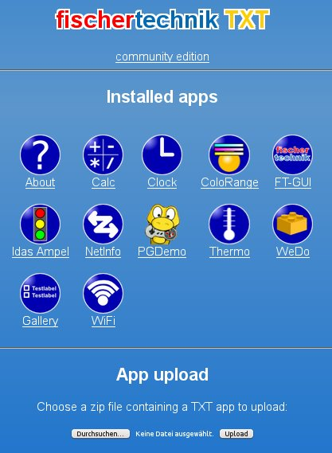
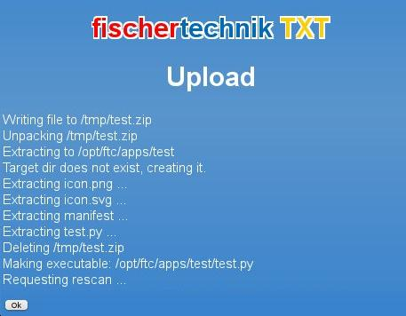
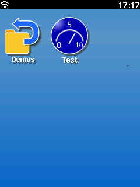
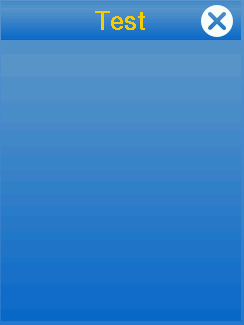
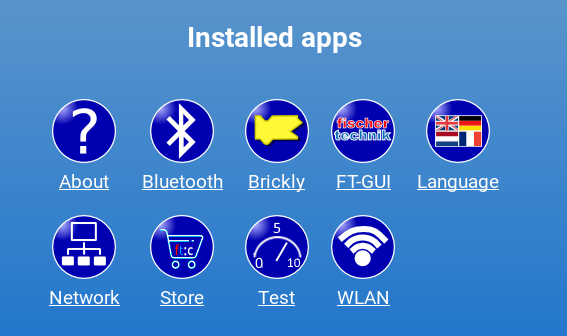
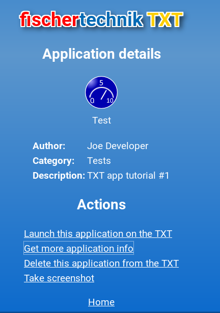

# Programming in Python: The First App

This tutorial will give a basic introduction on how to write an application
for the Community Firmware of the Fischertechnik TXT controller.

An app consists of at least three files:

 * The application program (executable) itself. This is typically a
   python script. But it could equally well be a native binary or a
   script in any other language supported by the TXT. Since
   [python](https://www.python.org) has become the de-facto standard
   for software written for the TXT this tutorial will also use the
   python language.
   **Please note:**
   * Spaces are the preferred indentation method in Python 3. Python 3 disallows mixing the use of tabs and spaces for indentation.
   * The line endings for Python code for CFW must be a single Line-Feed (LF), ASCII-Code 10 character. If you use Windows for writing program code, please make sure that your editor is able to save the code with the correct file endings.

 * A manifest file. This is a small text file containing additonal
   information about the App like its display name, its author and the
   name of the executable.

 * An icon. This should be a 64x64 pixel PNG file which is being used
   in the launcher as well as the web interface.

## The application program

The application program can be any script or binary the TXT is able to
execute. Since apps are usually started from the TXTs launcher the
user will expect some output on the screen. Thus the program should include
a minimalistic GUI.

Currently all apps use the [Qt4-Toolkit](http://www.qt.io/) for their user
interface. We'll thus also use Qt. A minimal python application opening
a TXT styled window looks like this:

```

```

Please save this file under the name [`test.py`](../../../media/examples/python/tutorial-1/test.py)

This app subclasses the TouchApplication class which was imported from
TouchStyle. It creates a window labeled "Test", shows that window and
hands over execution to the window so it can interact with the user
until it's closed.

## The manifest

The manifest file is a simple text file containing various fields
describing the app.

```

```

The mandatory fields are name, icon, desc, exec, uuid and managed.

 * **name** is the display name of the app as used e.g. in the
   launcher. It should be short enough to fit below the icon.
 * **icon** is name of the icon file. This is usually `icon.png`
 * **desc** is a short description of the app. This is currently
   only used in the web interface
 * **exec** is the name of the executable. In this example it refers
   to our test.py python script.
 * **uuid** is a unique id used to identify this app. You can generate
   one for your app e.g. online with services like [this](https://www.famkruithof.net/uuid/uuidgen). The uuid identifies an app, so all versions of an app must use the same uuid. The uuid is also used to generate the apps' unique directory on the TXT. Make sure that each app has its own unique id.
 * **managed** is currently unused and should be set to yes. This tells
   the launcher that the app has a Qt GUI. In the future this will
   allow the launcher to support apps using a different GUI toolkit.
 * **version** is the current version number of this app.
 * **firmware** is the firmware version number this app has been tested for. Currently only 0.9 exists. Later this will allow ranges like 0.9-1.1

Some optional fields are also used:

 * **category** is used to group apps in the launcher
 * **author** gives information about the developer of this app
 * **url** can be used to link to a web page describing the app.
  * **html** gives the name of the start file of the app's web interface on the TXT, e.g. index.html.
 * **set** optionally refers to the Fischertechnik set related to a model the app can be used for. E.g. `524328 ROBOTICS TXT Discovery Set`
 * **model** optionally refers to the english model name from the set. E.g. `Pedestrian Light`

The **set** and **model** entries are currently unused but may be used in the future to allow the user to find apps relating to a specific model he e.g. just built.

Please save this file under the name [`manifest`](../../../media/examples/python/tutorial-1/manifest)

# The icon

The icon can be any file in JPG or PNG format. It should be 64x64 pixels in
size.


An example file can be found at [here](../../../en/programming/python/icon.png)

This icon has been created using the [Inkscape](https://inkscape.org/) but most other paint programs will also do. The inkscape SVG file for this icon is also available [here](https://raw.githubusercontent.com/ftCommunity/ftcommunity-apps/master/packages/app_tutorial_1/icon.svg)

# Package it up

Now we have the three mandatory files

 * `test.py` the app programm code itself
 * `manifest` the text file describing the app
 * `icon.png` the icon for the launcher

To get these installed on the TXT they'll need to be put into a ZIP
archive. Any program like WinZIP should work. All three files should be
in the toplevel of the ZIP and not e.g. in some subfolder.

A prepared archive of our little demo app is also [available](https://github.com/ftCommunity/ftcommunity-TXT/raw/44dd2e2903880e5927a188c49f623cbcc83e3a3e/docs/_includes/examples/python/tutorial-1/test.zip).

# Upload it to the TXT

Now use your PC's web browser to connect to the TXT. The main web page will
show all installed apps:



Use the file dialog to select our test.zip archive and hit upload:



The app is now being intalled on the TXT and becomes visible in the
TXTs launcher:



The app can be launched like any other app by clicking it:



It's now also visible in the web interface:



Selecting it shows some of the details from the manifest file:



In the web interface, you can also delete the app.

Continue reading [Programming Python: Development](tutorial-2.md)
